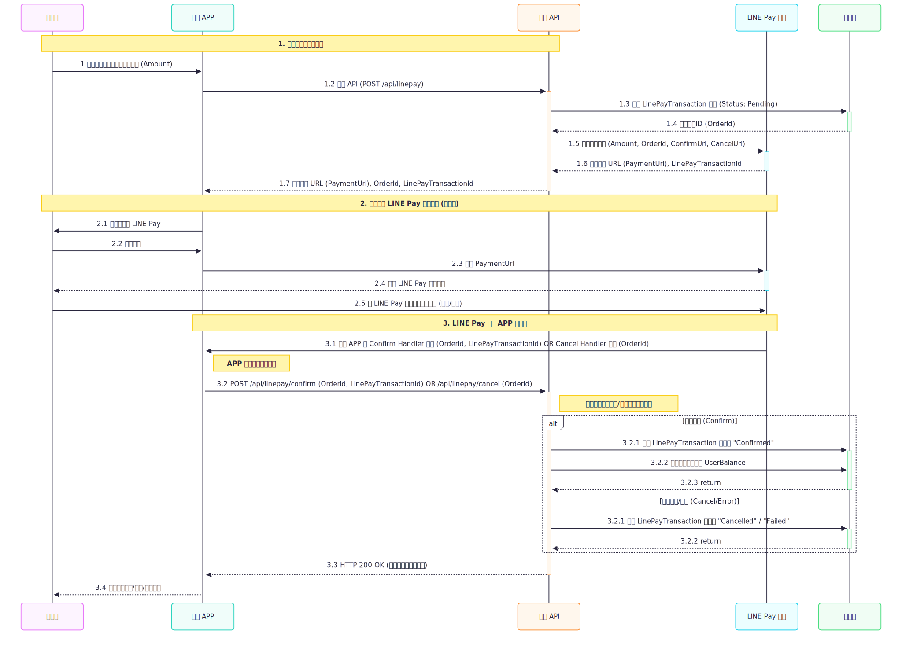

## LINE Pay 點數系統

## 1. 專案簡介
本專案旨在建立一個基於 ASP.NET Core Web API 的 LINE Pay 點數系統。它讓使用者能夠透過 LINE Pay 線上儲值點數，並使用這些點數在系統內部消費商品。

系統採用清晰的分層架構 (Layered Architecture)，並結合了領域驅動設計 (Domain-Driven Design, DDD) 的概念。所有資料都透過 Entity Framework Core 持久化到 SQL Server 資料庫，確保了系統的高內聚、低耦合、易於維護和擴展。

## 2. 主要功能
### 2.1 LINE Pay 點數儲值：
- 使用者透過前端/APP 發起儲值請求。
- 導向 LINE Pay Sandbox 環境完成支付。
- 支付成功後，點數會自動加值到使用者帳戶。
- 處理支付取消和失敗情況。
- 前端/APP 會透過輪詢 (Polling) 方式獲取支付結果，保持使用者介面即時更新。

### 2.2 點數消費：
- 提供 API 供前端/APP 獲取商品列表。
- 使用者使用帳戶點數購買商品。
- 自動從使用者餘額中扣除點數。

### 2.3 點數餘額管理：
- 提供 API 查詢使用者點數餘額。
- 記錄所有點數的進出交易。

### 2.4 商品管理：
- 管理系統內部的商品資訊（名稱、價格、描述）。

## 3. 技術棧
- 後端框架： ASP.NET Core 8
- 程式語言： C#
- 資料庫： Microsoft SQL Server
- 物件關係映射 (ORM)： Entity Framework Core 8
- HTTP 客戶端： HttpClient
- 依賴注入 (DI)： .NET Core 內建 IoC Container
- 外部服務： LINE Pay Online API (Sandbox 環境，用於測試)
- 跨域資源共享 (CORS)： 已配置，方便前端/APP 呼叫。

## 4. 環境設定
在啟動專案之前，請確保您的開發環境已備妥以下必要項目：

- Visual Studio 2022 (或更高版本)：
請確保安裝了 ASP.NET 和 Web 開發 工作負載。
- .NET 8 SDK
- SQL Server
- LINE Pay 商家帳號 (Sandbox 環境)：
  
  > 請登入 LINE Pay 商家管理後台。

  >  申請並啟用 Sandbox 環境，以取得您的 Channel ID 和 Channel Secret。這些是您測試時與 LINE Pay API 溝通的憑證。

  > 將這些憑證複製並貼上到 Web 專案 appsettings.json 檔案中的 LinePaySettings 區塊。
  
  > 請注意：在 Sandbox 環境測試支付時，您必須使用 LINE Pay 提供的測試帳戶，而不是您自己的真實 LINE 帳號。

## 5. 專案結構與職責
本解決方案採用分層架構，包含以下核心專案：
### Api (ASP.NET Core Web API)
#### 職責
- 專案的入口點，暴露 RESTful API 服務給前端/APP
- 負責處理 HTTP 請求，協調各後端服務，並設定應用程式的整體行為。

#### 關鍵檔案
- Program.cs
  - 應用程式的啟動檔案，負責服務註冊 (依賴注入)、HTTP 請求管線 (Middleware) 配置、以及 CORS 設定。

- Controllers/HomeController.cs
  - 處理前端/APP 的支付啟動、商品查詢、購買等主要 API 端點。

- appsettings.json
  - 應用程式設定，包括 LINE Pay 憑證和資料庫連接字串。

### LinePay (Class Library)

#### 職責
封裝所有與 LINE Pay API 相關的邏輯。

#### 主要組件

- LinePayApiHttpClient.cs
  - 負責與 LINE Pay 進行底層 HTTP 通訊和簽章處理。

- LinePayPaymentService.cs
  - 提供高階的 LINE Pay 支付業務邏輯，協調 LinePayApiHttpClient 和 Transaction 服務。

### Product (Class Library)

#### 職責
管理系統中可供購買的商品資訊。

#### 主要組件

- Models/ProductItem.cs
  - 商品的資料模型
- ProductService.cs
  - 提供產品查詢等業務邏輯服務。

### Order (Class Library)

#### 職責
處理使用者訂單的建立與狀態管理。

#### 主要組件
- Models/Order.cs
  - 訂單的資料模型。

- OrderService.cs
  - 提供訂單建立、支付標記、取消訂單等業務邏輯服務。

Transaction (Class Library)

職責： 管理與金流和點數餘額相關的所有交易記錄 (LinePayTransaction) 和使用者點數餘額 (UserBalance)。

主要組件：

Models/LinePayTransaction.cs: LINE Pay 儲值交易的詳細記錄模型。

Models/UserBalance.cs: 使用者點數餘額的資料模型。

Data/TransactionDbContext.cs: 定義資料庫上下文，處理 LinePayTransaction 和 UserBalance 的資料庫映射。

Repositories/EfLinePayTransactionRepository.cs: 使用 EF Core 與資料庫進行 LINE Pay 交易記錄操作。

Repositories/EfUserBalanceRepository.cs: 使用 EF Core 與資料庫進行使用者點數餘額操作。

TransactionService.cs: 提供 LINE Pay 交易創建/更新、使用者點數增減、餘額查詢等核心業務邏輯服務。

6. 啟動專案
請按照以下步驟啟動您的專案：

開啟解決方案： 在 Visual Studio 中打開 LinePayPointsSystem.sln 檔案。

更新 NuGet 套件： 建議您在 Visual Studio 中透過 工具 -> NuGet 套件管理員 -> 管理解決方案的 NuGet 套件，確保所有專案的套件都是最新版本。

配置 appsettings.json： 根據上述「環境設定」步驟 4 中的說明，填寫您的 LINE Pay 憑證和資料庫連接字串。

建立/更新資料庫：

打開 NuGet 套件管理員主控台 (Tools > NuGet Package Manager > Package Manager Console)。

為每個資料庫專案執行資料庫遷移命令。 確保在執行每個命令前，將 Default project 設定為相應的專案。

設定 Default project 為 Transaction：

Add-Migration InitialTransactionDbCreate
Update-Database

設定 Default project 為 Product：

Add-Migration InitialProductDbCreate
Update-Database

設定 Default project 為 Order：

Add-Migration InitialOrderDbCreate
Update-Database

這些命令將根據您的 EF Core 配置在 SQL Server 中建立所需的資料庫和表格。

啟動 ngrok：

在命令提示字元或終端機中，導航到 ngrok 的安裝目錄。

執行 ngrok http <您的 Web 專案埠號> (例如：ngrok http 7001)。

複製 ngrok 提供的 HTTPS Forwarding URL (例如 https://abcdef.ngrok-free.app)。這個 URL 將作為 LINE Pay 回調的目標。

運行 Web 專案：

在 Visual Studio 的「解決方案總管」中，右鍵點擊 Web 專案，選擇 設定為啟動專案。

點擊 IIS Express 或按下 F5 啟動專案。

您的 Web API 服務現在應該在 https://localhost:<埠號> 和您 ngrok 提供的公開 URL 上運行。

7. API 端點 (供前端/APP 串接)
所有 API 端點皆會返回 JSON 格式的響應。

7.1. 點數儲值 API

7.1.1. 啟動 LINE Pay 儲值

URL： POST /api/home/initiate-deposit

方法： POST

用途： 向後端發起儲值請求，獲取 LINE Pay 支付 URL。

請求 Body (JSON)：

{
    "amount": 100 // 欲儲值的點數金額
}

成功回應 (JSON)：

{
    "success": true,
    "paymentUrl": "https://sandbox-pay.line.me/...", // 導向 LINE Pay 的 URL
    "message": "Redirecting to Line Pay",
    "orderId": "DEP20250702160000001ABCD" // 後端生成的訂單 ID，APP 需儲存此 ID 以用於後續輪詢
}

APP 需執行： 取得 paymentUrl 後，使用 WebView 或導向外部瀏覽器讓使用者前往此 URL 完成 LINE Pay 支付。同時儲存 orderId 以供後續查詢。

失敗回應 (JSON)：

{
    "success": false,
    "message": "儲值金額必須大於 0。" // 或其他錯誤訊息
}

7.1.2. 查詢 LINE Pay 儲值狀態 (輪詢)

URL： GET /api/home/deposit-status/{orderId}

方法： GET

用途： APP 定期向後端查詢某筆 LINE Pay 儲值交易的最新狀態。

路徑參數：

orderId (string, 必填)：要查詢的交易訂單 ID (從 initiate-deposit 成功回應中獲取)。

成功回應 (JSON)：

{
    "success": true,
    "orderId": "DEP20250702160000001ABCD",
    "status": "Confirmed", // 可能為 "Pending", "Confirmed", "Failed", "Cancelled"
    "amount": 100.00
}

APP 處理邏輯：

"status": "Confirmed"： 表示支付成功。APP 停止輪詢，顯示成功訊息，並更新使用者介面。

"status": "Failed" 或 "status": "Cancelled"： 表示支付失敗或取消。APP 停止輪詢，顯示錯誤訊息。

"status": "Pending"： 支付仍在處理中。APP 繼續輪詢 (例如每 3-5 秒一次)，直到狀態改變或達到最大輪詢時間。

失敗回應 (JSON)：

{
    "success": false,
    "message": "找不到該筆交易。" // 或其他錯誤訊息
}

7.2. 點數消費 API

7.2.1. 取得商品列表與使用者點數

URL： GET /api/home/products

方法： GET

用途： 獲取所有可購買的商品列表以及當前使用者（目前硬編碼為 UserId=1）的點數餘額。

請求參數： 無

成功回應 (JSON)：

{
    "success": true,
    "userBalance": 500.00, // 使用者當前點數餘額
    "products": [
        {
            "id": 1,
            "name": "魔法棒",
            "price": 100.00,
            "description": "一支給有抱負巫師的魔法棒。"
        },
        {
            "id": 2,
            "name": "生命藥水",
            "price": 50.00,
            "description": "恢復你的能量。"
        }
        // ... 更多商品
    ]
}

7.2.2. 購買商品

URL： POST /api/home/purchase

方法： POST

用途： 使用點數購買指定商品。

請求 Body (JSON)：

{
    "productId": 1, // 欲購買商品的 ID
    "quantity": 1   // 欲購買商品的數量
}

成功回應 (JSON)：

{
    "success": true,
    "message": "成功購買！剩餘點數：400.00",
    "remainingBalance": 400.00 // 購買後剩餘的點數
}

失敗回應 (JSON)：

{
    "success": false,
    "message": "點數扣除失敗：點數不足。", // 或其他錯誤訊息
    "remainingBalance": 50.00 // 失敗時的當前餘額
}

8. 常見問題 (FAQ)
Q: 為什麼發起儲值後，APP 會需要輪詢？

A: LINE Pay 支付完成後會直接導向後端 API，APP 無法直接得知結果。透過輪詢後端提供的狀態查詢 API，APP 才能非同步地獲取交易結果並更新介面。

Q: 我在本地開發，但 LINE Pay 儲值後無法回呼我的 API？

A: 您需要運行 ngrok 將您的本地 API 暴露到一個公共的 HTTPS 網址。並確保在 initiate-deposit 請求中，傳遞給 LINE Pay 的 ConfirmUrl 和 CancelUrl 是您 ngrok 提供的 HTTPS 網址。

Q: 哪裡可以找到 LINE Pay Sandbox 測試帳戶？

A: 請登入您的 LINE Pay 商家管理後台，在 Sandbox 設定相關頁面中查找。

Q: 如何處理使用者登入和 UserId？

A: 目前範例中的 UserId 是硬編碼的 (例如 1)。在實際應用中，您需要實作使用者認證（如 JWT 或 OAuth），並在 APP 發送請求時，將使用者的 Token 帶到後端。後端會從 Token 中解析出真實的 UserId，替換掉硬編碼的部分。

Q: 後端 API 有設定 CORS 嗎？

A: 是的，Program.cs 中已配置 CORS，允許來自特定來源的請求 (可根據您的 APP 部署網域進行調整)。